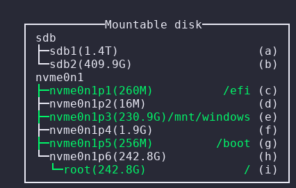

# TMUX Plugin for mounting device with `udisksctl`

Shows a menu for handling mount/unmount disk with `udisksctl`.




## Installation
### Requirement
* Python
* udisksctl
* Tmux

### With Tmux Plugin Manager
Add the plugin in `.tmux.conf`:
```
set -g @plugin 'c3r34lk1ll3r/tmux-mount.git'
```
Press `prefix + I` to fetch the plugin and source it. Done.

### Manual
Clone the repo somewhere. Add `run-shell` in the end of `.tmux.conf`:

```
run-shell PATH_TO_REPO/tmux-nm.tmux
```

Resource the file (or restart Tmux).

## Usage
Press Tmux `prefix + O` (for example, `C-b O`) and a menu will compare.

<p align="center">
  
</p>

Selecting a __mounted__ device, that will be unmount. Instead, selecting a __umounted__ device, that will mounted.


## TODO
- [ ] A lot of testing

## License
tmux-mount plugin is released under the [MIT License](https://opensource.org/licenses/MIT).
